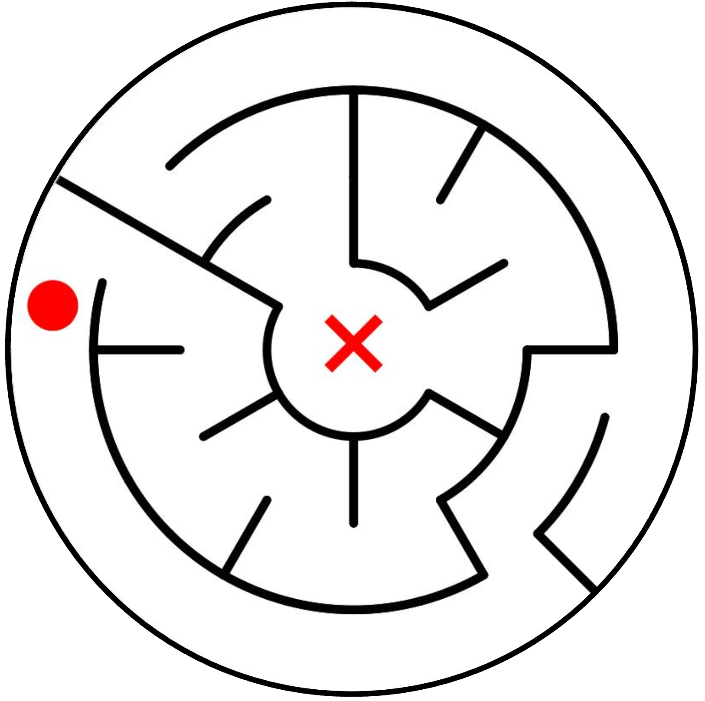
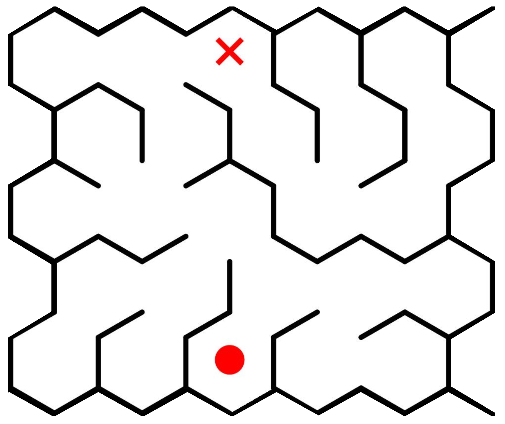
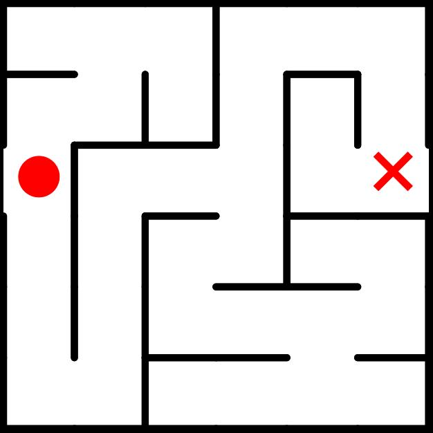
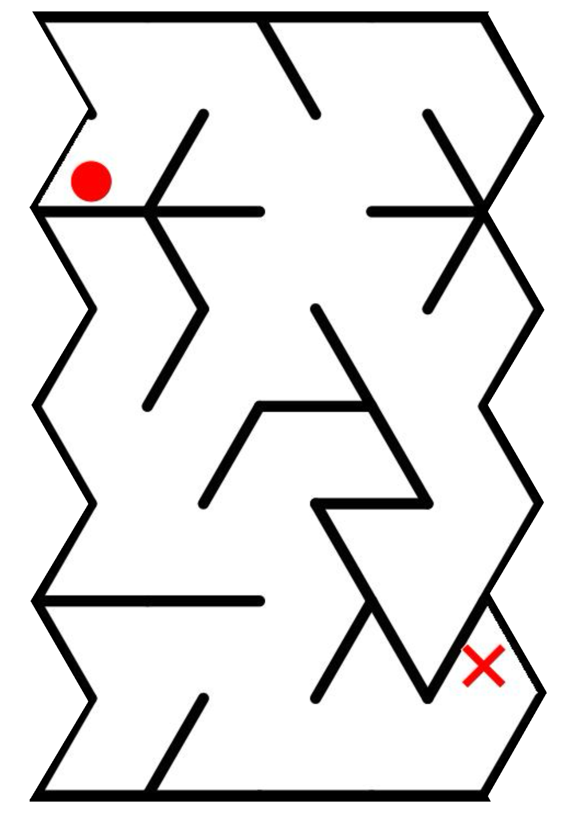

<h1 align="center"> Amaze: <br>Using Image Editing Models for Visual Planning </h1>
<div align="center">
  <a href='https://huggingface.co/datasets/piekenius123/Amaze'></a>&nbsp;&nbsp;
  <a href='https://spatigen.github.io/amaze.io/'></a>
</div>

# Amaze

This repository contains the codebase for fine-tuning, inferring, and evaluating image editing models on the **Amaze Bench**. It supports Supervised Fine-Tuning (SFT) and specialized evaluation metrics for maze-solving tasks.

<div align="center">
  
  
  
  
</div>

## 🚀 Supported Models
The framework currently supports the following architectures:
*   **Bagel**
*   **Janus-Pro-7B**
*   **Qwen-Image-Edit**
*   **API-based Models** (via generic API inference)

## 📂 Project Structure

```text
.
├── config/                 # Configuration files for base settings, maze tasks, and SFT
├── data/                   # Core dataset processing and loaders for Amaze
├── infer/                  # Inference engines and model definitions
│   ├── bagel/              # Specific modeling code for the Bagel architecture
│   │   ├── modeling/       # Custom model layers (Autoencoder, Qwen2, SigLIP)
│   ├── infer_*.py          # Inference entry points for different models (API, Bagel, Janus, Qwen)
│   └── maze_metrics.py     # Evaluation metrics specifically for Maze tasks
├── scripts/                # Shell scripts for batch inference
└── sft/                    # Supervised Fine-Tuning scripts
    ├── bagel/              # SFT logic for Bagel
    └── janus/              # SFT logic for Janus
```

## 🛠️ Installation

1.  **Clone the repository:**
    ```bash
    git clone amaze
    cd amaze
    ```

2.  **Install Dependencies:**
    Ensure you have Python 3.10+ and PyTorch installed.
    ```bash
    pip install -r requirements.txt
    ```

## 📊 Data Preparation

The code relies on the **Amaze** Bench. You can use it: 
```bash
from datasets import load_dataset

ds = load_dataset("piekenius123/Amaze") 
``` 

There are four shapes in total: circle, hexagon, square, triangle. In each shape, `maze_dataset` is the test set and `maze_dataset_train` is the train set. 
In test set, `*_test.parquet` is the size ranging from 3\*3 to 16\*16. And `*_test_32.parquet` is the size of 32\*32.


## 🏋️ Supervised Fine-Tuning (SFT)

You can fine-tune supported models using the scripts provided in the `sft/` directory.

### Training Bagel
```bash
cd sft/bagel
git clone https://github.com/ByteDance-Seed/Bagel.git
bash run_sft.sh
```
*Note: Adjust hyperparameters in `run_sft.sh` or `config/sft.py` before running.*

### Training Janus
```bash
cd sft/janus
git clone https://github.com/deepseek-ai/Janus.git
python sft.py
```

## ⚡ Evaluation

The `infer/` directory contains python scripts to generate responses from models and calculate maze-specific metrics.

### Running Inference
You can run inference using the Python scripts directly or via the helper shell scripts in `scripts/`.

**Using Shell Scripts:**
```bash
# For Bagel
bash scripts/infer_bagel.sh

# For Janus
bash scripts/infer_janus.sh

# For API-based models
bash scripts/batch_api.sh

bash scripts/infer_qwen.sh
```

### Evaluation Metrics
The core evaluation logic is located in `infer/maze_metrics.py`. This script calculates accuracy, and other maze-solving statistics based on the model's output.

## ⚙️ Configuration

Configurations are managed in the `config/` folder:
*   `base.py`: General settings.
*   `maze.py`: Specific parameters for the Amaze Bench.
