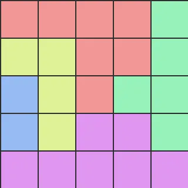

<h1 align="center">Amaze:<br>Using Image Editing Models for Visual Planning</h1>

<div align="center">
  <a href="https://huggingface.co/spaces/piekenius123/Amaze-Visualization"></a>&nbsp;&nbsp;
  <a href="https://arxiv.org/abs/2604.22868"></a>&nbsp;&nbsp;
  <a href="https://spatigen.github.io/amaze.io/"></a>
</div>

# AMAZE

This repository contains the codebase for fine-tuning, inferring, and
evaluating image editing models on **AMAZE**, a visual planning benchmark
for editing an input puzzle image into its solved state.

Amaze currently covers two task families:

- **Maze solving**: add the valid path from the entrance to the exit while
  preserving the original maze.
- **Queens puzzle solving**: place queens on a colored-region board so that each
  row, column, and region contains exactly one queen, with no two queens touching
  in the 8-neighborhood.

<div align="center">
  
  
  
  
  
</div>

## Supported Models

The framework currently supports the following image editing backends:

- **Bagel**
- **Janus-Pro-7B**
- **Qwen-Image-Edit**
- **API-based models** through the generic API inference script

## Project Structure

```text
.
|-- assets/                 # README images for maze and queen examples
|-- config/                 # Base, task, and SFT configuration files
|-- data/                   # Parquet dataset loaders shared by supported tasks
|-- infer/                  # Inference scripts, model code, and maze metrics
|   |-- bagel/              # Bagel-specific inference/modeling code
|   |-- infer_api.py        # API-based image editing inference
|   |-- infer_bagel.py      # Bagel inference entry point
|   |-- infer_janus.py      # Janus inference entry point
|   |-- infer_qwen.py       # Qwen-Image-Edit inference entry point
|   `-- maze_metrics.py     # Maze path evaluation metrics
|-- mazes-generator/        # Maze sample generation and parquet conversion
|-- queen-generator/        # Queens puzzle generation and parquet conversion
|-- scripts/                # Shell wrappers for batch inference
`-- sft/                    # Supervised fine-tuning scripts
    |-- bagel/
    `-- janus/
```

## Installation

1. Clone the repository:

   ```bash
   git clone amaze
   cd amaze
   ```

2. Install Python dependencies:

   ```bash
   pip install -r requirements.txt
   ```

Some dataset-generation utilities have extra dependencies. See
`mazes-generator/README.md` and `queen-generator/README.md` for task-specific
setup instructions.

## Data Preparation

The training and inference code expects parquet datasets with image columns such
as `original_img`, `m_original_img`, `sol_img`, and `cell_map`. Maze datasets can
also include `mask_img` and detailed path metadata.

### Load Amaze From Hugging Face

```python
from datasets import load_dataset

ds = load_dataset("piekenius123/Amaze")
```

The maze portion contains four shapes: circle, hexagon, square, and triangle.
For each shape, `maze_dataset_train` is the train split and `maze_dataset_test`
is the test split. Test files cover sizes from 3x3 to 16x16, with separate 32x32
test files when available.

### Generate Maze Data

Use the maze generator to create maze images, solution images, cell maps, masks,
and parquet files:

```bash
cd mazes-generator
node batch-maze-generator.js config maze-config.json
python process_maze_into_parquet.py --maze-dir ./generated_mazes --no-markers-dir ./generated_mazes_no_markers --solution-dir ./generated_solutions --metadata-dir ./generated_metadata --output ./maze-dataset/maze_dataset.parquet --train-ratio 0.9
```

See `mazes-generator/README.md` for the full command reference.

### Generate Queens Data

Use the queen generator to create unique-solution Queens puzzle boards and
convert them to the same parquet-style dataset interface:

```bash
cd queen-generator
python generate_queens_puzzle.py --n 7 --count 100 --outdir ./output_queens_n7 --seed 1 --cell-size 64 --queen-radius 16 --image-format png
python convert_queen_to_parquet.py --queen-outdir ./output_queens_n7 --dataset-outdir ./queen_dataset_n7 --test-ratio 0.2
```

The converter writes `maze_dataset_train.parquet` and
`maze_dataset_test.parquet` so existing dataset loaders and inference scripts can
read the generated Queens data by changing `--dataset_path`.

See `queen-generator/README.md` for details on puzzle rules, output layout, and
conversion options.

## Supervised Fine-Tuning (SFT)

Fine-tuning scripts are provided under `sft/`. They use the shared dataset
format, so the same training flow can be pointed at maze or queen parquet data.

### Training Bagel

```bash
cd sft/bagel
git clone https://github.com/ByteDance-Seed/Bagel.git
bash run_sft.sh
```

Adjust hyperparameters in `run_sft.sh` or `config/sft.py` before running.

### Training Janus

```bash
cd sft/janus
git clone https://github.com/deepseek-ai/Janus.git
python sft.py
```

## Inference

The `infer/` directory contains entry points for supported models. Inference is
dataset-driven: use a maze dataset path for maze solving, or a queen dataset
path for Queens puzzle solving.

You can run the Python scripts directly or use the shell wrappers:

```bash
# Bagel
bash scripts/infer_bagel.sh

# Janus
bash scripts/infer_janus.sh

# Qwen-Image-Edit
bash scripts/infer_qwen.sh

# API-based models
bash scripts/batch_api.sh
```

Example Qwen command:

```bash
accelerate launch --multi_gpu --num_processes 2 --mixed_precision bf16 infer/infer_qwen.py \
  --dataset_path ./queen-generator/queen_dataset_n7 \
  --model_path /path/to/Qwen-Image-Edit \
  --output_dir ./results/qwen_result/queen_n7 \
  --split test \
  --save_images \
  --num_inference_steps 10 \
  --num_attempts 5
```

## Evaluation

Maze evaluation logic is implemented in `infer/maze_metrics.py`. It measures
whether the edited output produces a valid path and reports maze-solving
statistics.

Queens datasets include solved-board images and JSON metadata produced by
`queen-generator`, so generated images can be inspected against the ground truth
through the shared parquet fields. Task-specific Queens metrics can be added on
top of the generated `sample_json`, `queens`, `regions`, and `cell_map`
metadata.

## Configuration

Configurations are managed in `config/`:

- `base.py`: General settings.
- `maze.py`: Maze-oriented training/evaluation presets. These presets can be
  adapted to Queens data by changing dataset paths and prompts.
- `sft.py`: Supervised fine-tuning settings.
